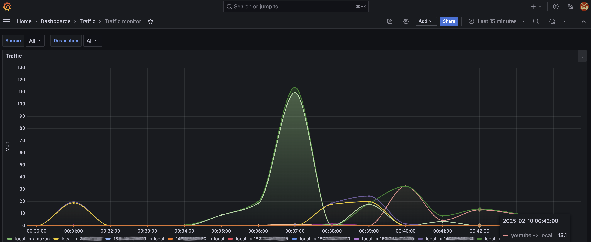

# texporter

texporter is a lightweight, high-performance eBPF-based network traffic exporter for Prometheus.

 [](https://github.com/kasd/texporter/blob/main/LICENSE)

## Introduction

Sometimes, you just need to understand where your traffic is coming from and going to, how much of it there is, and at what speed. That’s why I created `texporter`, which integrates into the Linux kernel using eBPF via XDP and TC hooks to collect traffic statistics.

This exporter is easy to install and has no dependencies other than a compatible Linux kernel version. It can aggregate cumulative traffic statistics for named IP address ranges.

For example, you can use it to monitor traffic to services like YouTube, corporate networks, or Zoom, helping you analyze bandwidth usage and network flows effectively.

## Requirements

A recent Linux kernel is required to run `texporter`. Many features rely on specific kernel functionalities and have minimum kernel version requirements. However, relying solely on kernel version numbers may not be sufficient for certain operating system distributions, as maintainers for distributions such as RHEL, Ubuntu, and SUSE often backport selected features to older kernel releases (retaining the older kernel version))

Minimum version to support TCX is ***6.6***.

- [Supported XDP Drivers](https://github.com/xdp-project/xdp-project/blob/master/areas/drivers/README.org)
- [BCC Kernel Compatibility](https://github.com/iovisor/bcc/blob/master/docs/kernel-versions.md#xdp)

### Installation and Usage

#### Installation

For **Debian**, **RedHat**, and **Alpine**-based distributions, you can download a pre-built package from the [Releases](https://github.com/kasd/texporter/releases) page and install it using your package manager:

- **Debian-based (Ubuntu, Debian, etc.):**
  ```sh
  dpkg -i texporter_VERSION.deb
  ```

- **RedHat-based (RHEL, CentOS, Fedora, etc.):**
  ```sh
  rpm -i texporter-VERSION.rpm
  ```

- **Alpine Linux:**
  ```sh
  apk add --allow-untrusted texporter-VERSION.apk
  ```

#### Running the Service

After installation, enable and start the service for your network interface:

```sh
systemctl enable texporter@[interface_name]
systemctl start texporter@[interface_name]
```

Example for `eth0`:

```sh
systemctl enable texporter@eth0
systemctl start texporter@eth0
```

This will ensure `texporter` starts automatically on boot and monitors the specified network interface.

## Building from source

To build `texporter`, follow these steps:

```sh
# Install build deps

apt install make git libbpf-dev

# Clone the repository
git clone https://github.com/kasd/texporter.git
cd texporter

# Build the project
make

# The binary will be located in the ./build directory
```

## Usage

Run `texporter` with the desired options:

```sh
sudo ./build/texporter --interface-name eth0 --log-level error --ip-ranges-filename config.json --port 2112
```

- `--interface-name`: Specifies the network interface to attach to (e.g., `eth0`).
- `--ip-ranges-filename`: Path to a JSON file containing IP ranges.
- `--log-level`: Sets the logging level (`trace`, `debug`, `info`, `warning`, `error`, `fatal`, `panic`). ([pkg.go.dev](https://pkg.go.dev/github.com/sirupsen/logrus))
- `--port`: Specifies the port for the metrics endpoint (default is `2112`).

Example `config.json` file:

```json
[
  {
    "name": "local",
    "ipv4": [
      "192.168.0.0/16",
      "10.0.0.0/8",
      "127.0.0.0/8",
      "100.64.0.0/10",
      "172.16.0.0/12"
    ],
    "ipv6": [
      "fe80::/10",
      "fc00::/7",
      "::1/128"
    ]
  },
  {
    "name": "zoom",
    "ipv4": [
      "3.7.35.0/25",
      "3.21.137.128/25"
    ],
    "ipv6": [
      "2407:30C0::/32",
      "2600:9000:2600::/48"
    ]
  }
]
```

Metrics will be available at `http://localhost:2112/metrics` for Prometheus scraping.

## Docker

A `Dockerfile` is provided for building and running `texporter` in a containerized environment.

Build the Docker image:

```sh
docker build -t texporter:latest .
```

Run the Docker container:

```sh
docker run --rm --privileged -p 2112:2112 -v /path/to/config.json:/config.json texporter:latest --interface-name eth0 --ip-ranges-filename /config.json --log-level error --port 2112
```

## Prometheus metrics

Setup Prometheus to scrape texporter metrics. Example config:

```
scrape_configs:
  - job_name: 'trafficmon'
    scrape_interval: 5s
    static_configs:
      - targets:
         - 'tailscale-exit:2112'
```

## Metrics example

```
# HELP go_gc_duration_seconds A summary of the wall-time pause (stop-the-world) duration in garbage collection cycles.
# TYPE go_gc_duration_seconds summary
go_gc_duration_seconds{quantile="0"} 0.000205209
go_gc_duration_seconds{quantile="0.25"} 0.000205209
go_gc_duration_seconds{quantile="0.5"} 0.000895166
go_gc_duration_seconds{quantile="0.75"} 0.000895166
go_gc_duration_seconds{quantile="1"} 0.000895166
go_gc_duration_seconds_sum 0.001100375
go_gc_duration_seconds_count 2
# HELP go_gc_gogc_percent Heap size target percentage configured by the user, otherwise 100. This value is set by the GOGC environment variable, and the runtime/debug.SetGCPercent function. Sourced from /gc/gogc:percent
# TYPE go_gc_gogc_percent gauge
go_gc_gogc_percent 100
# HELP go_gc_gomemlimit_bytes Go runtime memory limit configured by the user, otherwise math.MaxInt64. This value is set by the GOMEMLIMIT environment variable, and the runtime/debug.SetMemoryLimit function. Sourced from /gc/gomemlimit:bytes
# TYPE go_gc_gomemlimit_bytes gauge
go_gc_gomemlimit_bytes 9.223372036854776e+18
# HELP go_goroutines Number of goroutines that currently exist.
# TYPE go_goroutines gauge
go_goroutines 9
# HELP go_info Information about the Go environment.
# TYPE go_info gauge
go_info{version="go1.22.2"} 1
# HELP go_memstats_alloc_bytes Number of bytes allocated in heap and currently in use. Equals to /memory/classes/heap/objects:bytes.
# TYPE go_memstats_alloc_bytes gauge
go_memstats_alloc_bytes 971912
# HELP go_memstats_alloc_bytes_total Total number of bytes allocated in heap until now, even if released already. Equals to /gc/heap/allocs:bytes.
# TYPE go_memstats_alloc_bytes_total counter
go_memstats_alloc_bytes_total 4.654976e+06
# HELP go_memstats_buck_hash_sys_bytes Number of bytes used by the profiling bucket hash table. Equals to /memory/classes/profiling/buckets:bytes.
# TYPE go_memstats_buck_hash_sys_bytes gauge
go_memstats_buck_hash_sys_bytes 7992
# HELP go_memstats_frees_total Total number of heap objects frees. Equals to /gc/heap/frees:objects + /gc/heap/tiny/allocs:objects.
# TYPE go_memstats_frees_total counter
go_memstats_frees_total 49282
# HELP go_memstats_gc_sys_bytes Number of bytes used for garbage collection system metadata. Equals to /memory/classes/metadata/other:bytes.
# TYPE go_memstats_gc_sys_bytes gauge
go_memstats_gc_sys_bytes 2.4976e+06
# HELP go_memstats_heap_alloc_bytes Number of heap bytes allocated and currently in use, same as go_memstats_alloc_bytes. Equals to /memory/classes/heap/objects:bytes.
# TYPE go_memstats_heap_alloc_bytes gauge
go_memstats_heap_alloc_bytes 971912
# HELP go_memstats_heap_idle_bytes Number of heap bytes waiting to be used. Equals to /memory/classes/heap/released:bytes + /memory/classes/heap/free:bytes.
# TYPE go_memstats_heap_idle_bytes gauge
go_memstats_heap_idle_bytes 8.404992e+06
# HELP go_memstats_heap_inuse_bytes Number of heap bytes that are in use. Equals to /memory/classes/heap/objects:bytes + /memory/classes/heap/unused:bytes
# TYPE go_memstats_heap_inuse_bytes gauge
go_memstats_heap_inuse_bytes 3.260416e+06
# HELP go_memstats_heap_objects Number of currently allocated objects. Equals to /gc/heap/objects:objects.
# TYPE go_memstats_heap_objects gauge
go_memstats_heap_objects 12005
# HELP go_memstats_heap_released_bytes Number of heap bytes released to OS. Equals to /memory/classes/heap/released:bytes.
# TYPE go_memstats_heap_released_bytes gauge
go_memstats_heap_released_bytes 7.143424e+06
# HELP go_memstats_heap_sys_bytes Number of heap bytes obtained from system. Equals to /memory/classes/heap/objects:bytes + /memory/classes/heap/unused:bytes + /memory/classes/heap/released:bytes + /memory/classes/heap/free:bytes.
# TYPE go_memstats_heap_sys_bytes gauge
go_memstats_heap_sys_bytes 1.1665408e+07
# HELP go_memstats_last_gc_time_seconds Number of seconds since 1970 of last garbage collection.
# TYPE go_memstats_last_gc_time_seconds gauge
go_memstats_last_gc_time_seconds 1.7391374482719278e+09
# HELP go_memstats_mallocs_total Total number of heap objects allocated, both live and gc-ed. Semantically a counter version for go_memstats_heap_objects gauge. Equals to /gc/heap/allocs:objects + /gc/heap/tiny/allocs:objects.
# TYPE go_memstats_mallocs_total counter
go_memstats_mallocs_total 61287
# HELP go_memstats_mcache_inuse_bytes Number of bytes in use by mcache structures. Equals to /memory/classes/metadata/mcache/inuse:bytes.
# TYPE go_memstats_mcache_inuse_bytes gauge
go_memstats_mcache_inuse_bytes 14400
# HELP go_memstats_mcache_sys_bytes Number of bytes used for mcache structures obtained from system. Equals to /memory/classes/metadata/mcache/inuse:bytes + /memory/classes/metadata/mcache/free:bytes.
# TYPE go_memstats_mcache_sys_bytes gauge
go_memstats_mcache_sys_bytes 15600
# HELP go_memstats_mspan_inuse_bytes Number of bytes in use by mspan structures. Equals to /memory/classes/metadata/mspan/inuse:bytes.
# TYPE go_memstats_mspan_inuse_bytes gauge
go_memstats_mspan_inuse_bytes 159520
# HELP go_memstats_mspan_sys_bytes Number of bytes used for mspan structures obtained from system. Equals to /memory/classes/metadata/mspan/inuse:bytes + /memory/classes/metadata/mspan/free:bytes.
# TYPE go_memstats_mspan_sys_bytes gauge
go_memstats_mspan_sys_bytes 163200
# HELP go_memstats_next_gc_bytes Number of heap bytes when next garbage collection will take place. Equals to /gc/heap/goal:bytes.
# TYPE go_memstats_next_gc_bytes gauge
go_memstats_next_gc_bytes 4.194304e+06
# HELP go_memstats_other_sys_bytes Number of bytes used for other system allocations. Equals to /memory/classes/other:bytes.
# TYPE go_memstats_other_sys_bytes gauge
go_memstats_other_sys_bytes 1.992232e+06
# HELP go_memstats_stack_inuse_bytes Number of bytes obtained from system for stack allocator in non-CGO environments. Equals to /memory/classes/heap/stacks:bytes.
# TYPE go_memstats_stack_inuse_bytes gauge
go_memstats_stack_inuse_bytes 917504
# HELP go_memstats_stack_sys_bytes Number of bytes obtained from system for stack allocator. Equals to /memory/classes/heap/stacks:bytes + /memory/classes/os-stacks:bytes.
# TYPE go_memstats_stack_sys_bytes gauge
go_memstats_stack_sys_bytes 917504
# HELP go_memstats_sys_bytes Number of bytes obtained from system. Equals to /memory/classes/total:byte.
# TYPE go_memstats_sys_bytes gauge
go_memstats_sys_bytes 1.7259536e+07
# HELP go_sched_gomaxprocs_threads The current runtime.GOMAXPROCS setting, or the number of operating system threads that can execute user-level Go code simultaneously. Sourced from /sched/gomaxprocs:threads
# TYPE go_sched_gomaxprocs_threads gauge
go_sched_gomaxprocs_threads 12
# HELP go_threads Number of OS threads created.
# TYPE go_threads gauge
go_threads 18
# HELP process_cpu_seconds_total Total user and system CPU time spent in seconds.
# TYPE process_cpu_seconds_total counter
process_cpu_seconds_total 0.28
# HELP process_max_fds Maximum number of open file descriptors.
# TYPE process_max_fds gauge
process_max_fds 1.048576e+06
# HELP process_network_receive_bytes_total Number of bytes received by the process over the network.
# TYPE process_network_receive_bytes_total counter
process_network_receive_bytes_total 2.633364567e+09
# HELP process_network_transmit_bytes_total Number of bytes sent by the process over the network.
# TYPE process_network_transmit_bytes_total counter
process_network_transmit_bytes_total 2.049401271e+09
# HELP process_open_fds Number of open file descriptors.
# TYPE process_open_fds gauge
process_open_fds 24
# HELP process_resident_memory_bytes Resident memory size in bytes.
# TYPE process_resident_memory_bytes gauge
process_resident_memory_bytes 2.2433792e+07
# HELP process_start_time_seconds Start time of the process since unix epoch in seconds.
# TYPE process_start_time_seconds gauge
process_start_time_seconds 1.73913744204e+09
# HELP process_virtual_memory_bytes Virtual memory size in bytes.
# TYPE process_virtual_memory_bytes gauge
process_virtual_memory_bytes 2.769096704e+09
# HELP process_virtual_memory_max_bytes Maximum amount of virtual memory available in bytes.
# TYPE process_virtual_memory_max_bytes gauge
process_virtual_memory_max_bytes 1.8446744073709552e+19
# HELP promhttp_metric_handler_requests_in_flight Current number of scrapes being served.
# TYPE promhttp_metric_handler_requests_in_flight gauge
promhttp_metric_handler_requests_in_flight 1
# HELP promhttp_metric_handler_requests_total Total number of scrapes by HTTP status code.
# TYPE promhttp_metric_handler_requests_total counter
promhttp_metric_handler_requests_total{code="200"} 2
promhttp_metric_handler_requests_total{code="500"} 0
promhttp_metric_handler_requests_total{code="503"} 0
# HELP texporter_captured_bytes_total The total number of bytes captured by texporter
# TYPE texporter_captured_bytes_total counter
texporter_captured_bytes_total{dst="local",src="local"} 40460
texporter_captured_bytes_total{dst="youtube",src="local"} 504
```

## Grafana



## Contribution

Contributions are welcome! Feel free to open an issue or submit a pull request.

## License

`texporter` is licensed under the [Apache License Version 2.0](http://www.apache.org/licenses/LICENSE-2.0).

## Stargazers over time

[](https://starchart.cc/kasd/texporter)

